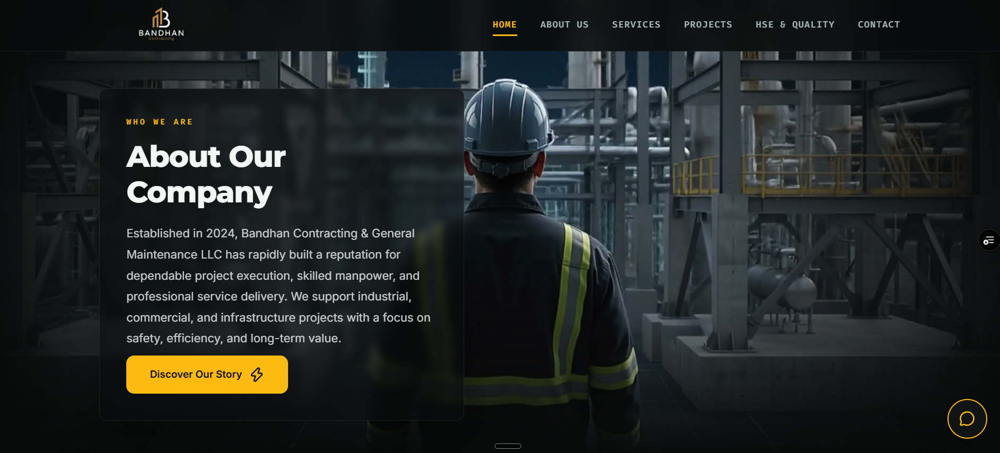

# Bandhan Contracting & General Maintenance LLC

**Live Link**: [bandhan-psi.vercel.app](https://bandhan-psi.vercel.app/)

## Project Description

A premium, fully responsive, and highly interactive static corporate website built for Bandhan Contracting & General Maintenance LLC. This website showcases civil engineering, earthworks, piping, and general contracting services with cutting-edge 3D interactive scrollytelling animations. Designed to impress, it ensures optimal speed and an immersive user experience without relying on heavy frameworks.

## Tech Stack

* **Frontend**: HTML5, CSS3 (Vanilla Custom Layouts & Glassmorphic variables), ES6+ Vanilla JavaScript (DOM manipulation)
* **Animation & Motion**: 
  * **GSAP (GreenSock Animation Platform)**: Orchestrates frame-by-frame 3D renders.
  * **GSAP ScrollTrigger**: Binds the 3D animation timeline directly to the viewport scroll position.
* **Icons**: **Lucide Icons** (served dynamically via CDN to keep the bundle footprint small).
* **Media Assets**: Web-optimized PNG/JPEG/WEBP images and high-fidelity video hero loops.
* **Build Setup**: **Zero-Build Architecture** (pure drag-and-drop static files).

## Features

* **3D Scrolltelling Showcase**: A state-of-the-art interactive canvas section on the home page. As the user scrolls, a preloaded 3D sequence (safety helmet -> pipeline installation -> sunset refinery) advances frame-by-frame. Uses heavily optimized `.webp` sequence frames and a custom animated liquid-fill logo loading screen.
* **Fluid Responsiveness**: Meticulously designed grid layouts and absolute content cards adapting dynamically across desktops, tablets, and phones.
* **Glassmorphic Navigation**: Sticky blurring navigation header providing a modern look.
* **WhatsApp Form Integration**: Built-in lead capture form that automatically formats and sends user inquiry inputs directly to the company WhatsApp endpoint.
* **Floating Quick Action Buttons**: Bottom-right floating contact dial for one-click calling or messaging.
* **Accessible Structure**: Correct semantic HTML5 structure with robust screen-reader markup.

## Local Setup / Run Instructions

No Node.js, `npm install`, or complex build step is needed to run or deploy the site.

### **Method 1: Local Server (Recommended for development)**
To prevent CORS (Cross-Origin Resource Sharing) restrictions when loading the 3D scroll canvas frames locally:
1. Open the repository directory in your preferred code editor (e.g. VS Code).
2. Install the **Live Server** extension.
3. Click **"Go Live"** at the bottom-right of VS Code, or right-click `index.html` and choose **"Open with Live Server"**.
4. The site will launch on `http://127.0.0.1:5500/`.

### **Method 2: Static Hosting Deployment**
1. Extract the provided ZIP archive.
2. Drag and drop the extracted files directly into a static hosting file manager (e.g. **Hostinger**, **cPanel**, **Vercel**, or **Netlify**).
3. The site is instantly live!
